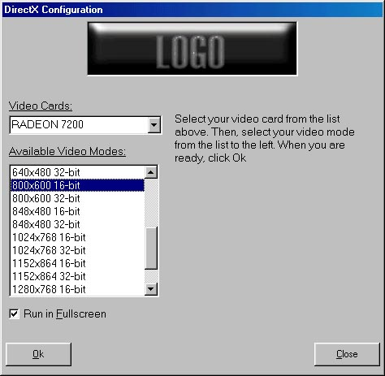



## DirectX/Direct3D Configuration Applet DLL

### Description

In keeping up with DirectX, it may be hard to find some good utility code that allows you to present the user with a configuration GUI, similar to the config GUI in Freespace 2, Half-Life or any other big game which relies on DirectX. This is a small ActiveX DLL which uses DirectX 8 to enumerate all of the video cards on the computer, and also displays the acceptable resolutions for each one. It can then return the values selected by the user in a format which DirectX understands (adapter number, mode number, fullscreen, etc.). Modification of the DLL is as easy as changing the D3DConfig.res file using the Resource Editor. It took me a little while to not overcook this problem, but I actually found a simplistic but powerful solution. Hopefully, this will help all of you out there to understand UI isn't just in the game, but also in the setup. Also enclosed in the zip is a README and a sample program. Use the .VBG file if you don't want to compile everything. Have fun, and don't forget to vote or comment on this if you want.
 
### More Info
 
Make sure you have DirectX 8.0 or higher installed on your computer before using.

             |
---                |---
**Submitted On**   |2002-04-29 21:53:46
**By**             |[Devin Watson](https://github.com/Planet-Source-Code/PSCIndex/blob/master/ByAuthor/devin-watson.md)
**Level**          |Beginner
**User Rating**    |5.0 (20 globes from 4 users)
**Compatibility**  |VB 6\.0
**Category**       |[DirectX](https://github.com/Planet-Source-Code/PSCIndex/blob/master/ByCategory/directx__1-44.md)
**World**          |[Visual Basic](https://github.com/Planet-Source-Code/PSCIndex/blob/master/ByWorld/visual-basic.md)
**Archive File**   |[DirectX\_Co773994292002\.zip](https://github.com/Planet-Source-Code/devin-watson-directx-direct3d-configuration-applet-dll__1-34237/archive/master.zip)

